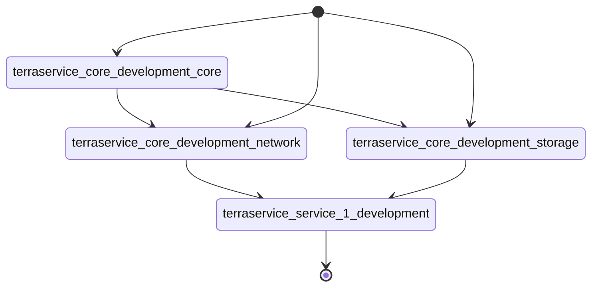

# Core
Core Terraform (TF) module to test a terraservice approach using Terraform Cloud (TFC)

This Core repository contains the core IaC through Terraform files that will expose outputs that will be consumed by other repositories.

The idea is that the repositories with the actual app/service code will hold as well their own Terraform files to setup their own infra. 
Those [service repositories](https://github.com/awoisoak/terraservice-service1) will be able to retrieve the core resources of the infra from the outputs of this Core repository.

This projects relies in TFC not just as a remote backend for the different Terraform states involved but to orchestrate the corresponding triggers of each TFC workspace:

Observations:
- Current module architecture (core/network/storage) is just an example.

TODO:

- Confirm whether the environemnt IaC files can create several resources from the modules by calling them twice (ex. we need to VPC so we called the network module twice). In that case we would need to set a second output for that vpc so that it could be consumed by other repos.

- rename module core to base to avoid confusion with 'core' repo?

- plan how to manage module versioning
